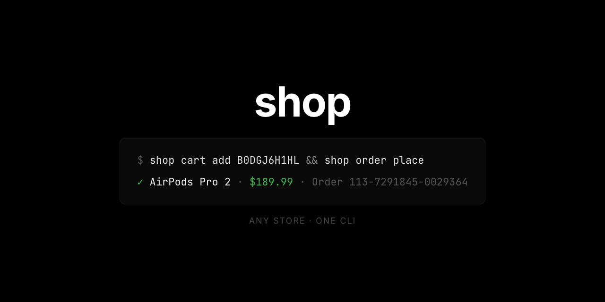

<div align="center">



# shop

**Shopping from your terminal. Any store. One interface. Just `shop`.**

[](https://go.dev)
[](LICENSE)
[]()

A multi-store shopping CLI with a unified interface. Search products, read reviews, manage your cart, and place real orders — all from your terminal with structured JSON.

---

**Search** · **Product Details** · **Reviews** · **Variants** · **Offers** · **Cart** · **Checkout** · **Order**

</div>

---

## What is this?

`shop` is a single-binary CLI that gives you programmatic access to online stores through their internal APIs — the same APIs their own apps use. No scraping, no browser automation, no third-party API keys. Just direct HTTP calls, authenticated natively.

```bash
# Search from your terminal
$ shop search "sony wf-1000xm5" | jq '.products[0] | {title, price, rating}'
{
  "title": "Sony WF-1000XM5 Wireless Earbuds",
  "price": { "amount": 22800, "currency": "USD" },
  "rating": { "average": 4.5, "count": 12847 }
}
```

Every command outputs structured JSON. Same interface regardless of store. Pipe to `jq`, feed to scripts, build automations.

---

## Features

|                                                     |                                                    |                                                      |
| :-------------------------------------------------- | :------------------------------------------------- | :--------------------------------------------------- |
| 🔍 **Product Search**                               | 📦 **Full Product Details**                        | 🌳 **Variant Trees**                                 |
| Filters, sorting, pagination, price ranges, ratings | Specs, features, images, descriptions, seller info | Every color, size, and configuration mapped to ASINs |
| ⭐ **Customer Reviews**                             | 🏷️ **Multi-Seller Offers**                         | 🛒 **Cart Management**                               |
| Sort by recent/helpful/rating, filter by stars      | All available sellers, conditions, and prices      | Add, remove, view, clear — full cart lifecycle       |
| 💳 **Real Checkout**                                | 📍 **Address & Payment**                           | 🌍 **6 Amazon Regions**                              |
| Preview orders, auto-select fastest shipping        | List saved addresses and payment methods           | US, UK, DE, JP, CA, AU — same binary                 |

---

## Quick Start

### Install

```bash
go install github.com/saucesteals/shop/cmd/shop@latest
```

### Authenticate

```bash
# Step 1: Start the auth flow
$ shop login amazon
{
  "status": "challenge",
  "challenge": {
    "type": "device_code",
    "code": "A4K7X2",
    "url": "https://www.amazon.com/code",
    "expiresIn": 600
  }
}

# Step 2: Complete the challenge, then run again
$ shop login amazon
{
  "status": "authenticated",
  "account": { "id": "A2F0K..." }
}
```

### Use as an AI agent skill

`shop skill` prints the embedded `SKILL.md` to stdout — pipe it anywhere to enable autonomous shopping for your AI agent:

```bash
# OpenClaw
mkdir -p ~/.openclaw/workspace/skills/shop
shop skill > ~/.openclaw/workspace/skills/shop/SKILL.md

# Claude Code
shop skill > .claude/shop.md
```

The skill teaches the agent every command, flag, and workflow — search, cart, checkout, order — so it can shop on your behalf.

### Set your default store

```bash
shop config set defaults.store amazon
```

### Search → Cart → Buy

```bash
# Find what you want
shop search "usb-c cable" --sort price_low --min-rating 4.0

# Get the details
shop product B0D1XD1ZV3

# Check the variants
shop variants B0D1XD1ZV3

# Read the reviews
shop reviews B0D1XD1ZV3 --sort helpful

# Add to cart
shop cart add B0D1XD1ZV3

# Preview the order
shop checkout

# Place it (⚠️ real money, real order)
shop order place <checkout-id>
```

That's the full flow. Search to doorstep, never leaving the terminal.

---

## How It Works

### Provider Architecture

Each store is implemented as a **provider** that reverse-engineers the store's public APIs. This means structured JSON responses, stable endpoints, and full feature access without scraping.

### Amazon Provider

The Amazon provider speaks **TVSS** (TV Shopping Service) — the internal API behind Amazon's Fire TV Shopping app at `tvss.amazon.com`.

```
┌──────────┐     device-code auth     ┌──────────────────┐
│          │ ◄──────────────────────► │  Amazon Auth API │
│   shop   │                          └──────────────────┘
│   CLI    │     TVSS JSON API        ┌──────────────────┐
│          │ ◄──────────────────────► │  tvss.amazon.com │
└──────────┘                          └──────────────────┘
```

**Authentication** uses Amazon's device-code pairing flow — the same mechanism Fire TV uses. You get a code, enter it at `amazon.com/code`, and the CLI registers as a device on your account. No passwords ever touch the CLI.

**Product data** comes from TVSS endpoints that return richly typed JSON — prices in minor units, structured variant dimensions, review distributions, full merchant info, and availability details.

**Search** uses Amazon's mobile search for ASIN discovery and ranking, then enriches results through TVSS for structured data.

### The approach

- **No API keys** — stores don't offer public product APIs. We don't need them.
- **No scraping** — No HTML parsing, no CSS selectors, no breaking on redesigns.
- **No browser** — No Puppeteer, no Playwright, no headless Chrome. Just HTTP.
- **Native auth** — authenticated as a real device on your account, per-provider.

---

## Command Reference

### Auth

```bash
shop login <store>       # Start or complete auth flow
shop logout <store>      # Revoke credentials and clear tokens
shop whoami              # Check current auth state
```

Auth is provider-specific — each store uses its native auth mechanism (device code, OAuth, etc.). Run `login` twice: first call returns a challenge, second call (after completing it) finishes auth. State persists in `~/.config/shop/auth/` with `0600` permissions.

### Search

```bash
shop search "protein powder"
shop search "headphones" --sort price_low --min-price 2000 --max-price 15000
shop search "laptop" --min-rating 4.0 --category Electronics
shop search "keyboard" --filter brand=Keychron --page 2
```

> **Prices are in cents** (minor units). `--min-price 2000` = $20.00.

<details>
<summary><strong>Search flags</strong></summary>

- `--sort` — `relevance`, `price_low`, `price_high`, `rating`, `newest`, `best_seller`
- `--page` — Page number (default 1)
- `--page-size` — Results per page
- `--min-price` — Minimum price in minor units (cents)
- `--max-price` — Maximum price in minor units (cents)
- `--min-rating` — Minimum average rating (e.g. `4.0`)
- `--category` — Category filter (provider-specific)
- `--filter` — Arbitrary `key=value` filter (repeatable)

</details>

<details>
<summary><strong>Example output</strong></summary>

```json
{
  "products": [
    {
      "id": "B0D1XD1ZV3",
      "title": "Sony WF-1000XM5 Wireless Earbuds",
      "url": "https://www.amazon.com/dp/B0D1XD1ZV3",
      "price": { "amount": 22800, "currency": "USD" },
      "rating": { "average": 4.5, "count": 12847 },
      "availability": { "status": "in_stock" },
      "badge": "best_seller"
    }
  ],
  "total": 16,
  "page": 1,
  "hasMore": true
}
```

</details>

### Product Details

```bash
shop product B0D1XD1ZV3
```

Returns the full product record: title, brand, price, list price, images, specs, features, description, seller info, availability, and variant metadata. Product IDs are Amazon ASINs (10-character alphanumeric).

### Variants

```bash
shop variants B0D1XD1ZV3
```

Returns variant dimensions (Color, Size, etc.) with all options and a `combinations` array mapping dimension values to ASINs and prices. Every permutation the product page shows, structured as data.

### Reviews

```bash
shop reviews B0D1XD1ZV3
shop reviews B0D1XD1ZV3 --sort recent --rating 5 --page 2
```

<details>
<summary><strong>Review flags</strong></summary>

- `--sort` — `recent`, `helpful`, `rating`
- `--rating` — Filter to specific star rating (1–5)
- `--page` / `--page-size` — Pagination

</details>

### Offers

```bash
shop offers B0D1XD1ZV3
shop offers B0D1XD1ZV3 --condition used_good
```

Returns seller offers for a product, including condition and pricing.

<details>
<summary><strong>Offer flags</strong></summary>

- `--condition` — `new`, `used_like_new`, `used_good`, `used_fair`, `refurbished`
- `--page` / `--page-size` — Pagination

</details>

### Cart

```bash
shop cart add B0D1XD1ZV3              # Add 1 unit
shop cart add B0D1XD1ZV3 --qty 3     # Add 3 units
shop cart view                        # View cart with subtotal
shop cart remove B0D1XD1ZV3           # Remove item
shop cart clear                       # Empty the cart
```

All cart commands return the full cart snapshot with items and subtotal.

### Checkout & Order

```bash
# Preview — see totals, shipping, payment (does NOT charge)
shop checkout

# Place the order (⚠️ irreversible — real money)
shop order place <checkout-id>
```

The `checkout-id` comes from the checkout preview response. If the cart changes between preview and placement, the order is rejected — no surprise charges.

<details>
<summary><strong>Checkout flags</strong></summary>

- `--address` — Shipping address ID
- `--payment` — Payment method ID
- `--shipping` — Shipping option ID
- `--coupon` — Coupon/promo code

</details>

### Account

```bash
shop addresses                        # List saved shipping addresses
shop payments                         # List saved payment methods
```

### Stores

```bash
shop stores                           # List all known stores
shop stores --provider amazon         # Filter by provider
shop store info                       # Current store details + capabilities
shop capabilities                     # What the store supports
```

---

## Global Flags

- `-s, --store` — Target store (name or domain). Default: config value or `SHOP_STORE` env.
- `--json` — Force compact JSON output
- `--pretty` — Force pretty-printed JSON output
- `--config` — Config directory path (default `~/.config/shop/`)
- `--timeout` — Request timeout (default `30s`)

---

## Output Format

All commands output **JSON to stdout**. Pretty-printed when interactive, compact when piped — override with `--json` or `--pretty`.

```bash
# Pretty in terminal
shop search "coffee"

# Compact for piping (auto-detected)
shop search "coffee" | jq '.products[] | {title, price}'

# Force compact
shop search "coffee" --json
```

### Money

All prices use **minor units** (cents). Never floating point.

```json
{ "amount": 2999, "currency": "USD" }
```

`2999` = $29.99. For JPY, minor units = whole yen.

### Errors

Structured JSON on stderr with typed error codes:

```json
{
  "code": "auth_required",
  "message": "not authenticated; run 'shop login --store amazon' first"
}
```

<details>
<summary><strong>Error code reference</strong></summary>

- `auth_required` (exit 10) — Not authenticated
- `auth_expired` (exit 11) — Session expired
- `auth_failed` (exit 12) — Authentication rejected
- `auth_timeout` (exit 13) — Auth flow timed out
- `store_not_found` (exit 20) — Unknown store
- `not_supported` (exit 21) — Operation not supported
- `not_found` (exit 30) — Product/resource not found
- `out_of_stock` (exit 31) — Product unavailable
- `cart_empty` (exit 40) — Cart has no items
- `cart_changed` (exit 41) — Cart changed since checkout preview
- `quantity_limit` (exit 42) — Exceeds store limit
- `rate_limited` (exit 50) — Too many requests
- `store_error` (exit 51) — Store-side error
- `network` (exit 60) — Network failure
- `invalid_input` (exit 2) — Bad arguments
- `config_error` (exit 3) — Config read/write failure
- `internal` (exit 1) — Unexpected error

</details>

---

## Configuration

```
~/.config/shop/
├── config.json          # User settings
├── registry.json        # Store → provider mapping
└── auth/
    └── amazon.json      # Auth state (0600 permissions)
```

```bash
shop config set defaults.store amazon
shop config set defaults.timeout 60s
shop config get defaults.store
shop config list
```

### Store Resolution

When you pass `--store amazon`, the CLI resolves it through:

1. **Registry** — exact alias or domain match in `registry.json`
2. **Auto-discovery** — providers probe the domain (sorted by cost, cheapest first)
3. **Cache** — discovered stores are saved for future lookups
4. **Fail** — `store_not_found` error

Also accepts raw domains (`amazon.co.uk`, `amazon.de`), `SHOP_STORE` env var, or the config default.

---

## Architecture

### Provider Abstraction

`shop` is built on a provider interface. Each store is a self-contained provider that implements the same interface:

```
                    ┌─────────────────────────────────────────┐
                    │              shop.Store                 │
                    │                                         │
                    │  Login · Search · Product · Reviews     │
                    │  Offers · Variants · Cart · Checkout    │
                    │  PlaceOrder · Addresses · Payments      │
                    └──────────────────┬──────────────────────┘
                                       │
                    ┌──────────────────┴──────────────────────┐
                    │          amazon.Store                   │
                    │                                         │
                    │  TVSS API ←→ tvss.amazon.com            │
                    │  Device auth ←→ api.amazon.com          │
                    │                                         │
                    │  US · UK · DE · JP · CA · AU            │
                    └─────────────────────────────────────────┘
```

Providers self-register via `init()` and a `shop.Register()` call. The resolution layer discovers them automatically — zero wiring:

```go
// internal/provider/amazon/amazon.go
func init() {
    shop.Register(&Provider{})
}

// cmd/shop/main.go
import _ "github.com/saucesteals/shop/internal/provider/amazon"
```

### Adding a New Provider

1. Create `internal/provider/<name>/` implementing `shop.Provider`, `shop.Store`, and `shop.Cart`
2. Call `shop.Register(&Provider{})` in `init()`
3. Add a blank import in `cmd/shop/main.go`

That's it. No config files, no factory registration, no dependency injection. The provider exists and the CLI finds it.

---

## Supported Stores

### Amazon

6 regions, full feature support:

| Store        | Domain          | Currency |
| :----------- | :-------------- | :------- |
| 🇺🇸 Amazon US | `amazon.com`    | USD      |
| 🇬🇧 Amazon UK | `amazon.co.uk`  | GBP      |
| 🇩🇪 Amazon DE | `amazon.de`     | EUR      |
| 🇯🇵 Amazon JP | `amazon.co.jp`  | JPY      |
| 🇨🇦 Amazon CA | `amazon.ca`     | CAD      |
| 🇦🇺 Amazon AU | `amazon.com.au` | AUD      |

```bash
shop search "coffee" --store amazon.co.jp
shop search "kaffee" --store amazon.de
```

More providers coming. The `shop.Provider` interface is all you need to add one.

---

## License

MIT

<sub>Built with ⚡ Jarvis</sub>
